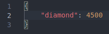

# Price Calculator
A price calculator for multiple things

# Example
This is in the *.json files
I have 0.0567kg diamond. The price of diamond in kg is: $4500.
Then it says: The price is: 510.3
I put in number.json:

And in price.json i put:

You can also do this with multiple things; then it just adds it up and give you the total price.

# Setup
1. Put your own things in number.json and price.json. If you don't know how, then you can see it by the example.
2. Run main.py

# Error codes
1. The "id's" from number.json and price.json are not the same. You can fix it by syncing all the "id's/name's" by getting them from number.json to price.json.

The id diamond.